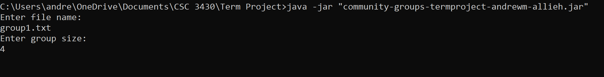
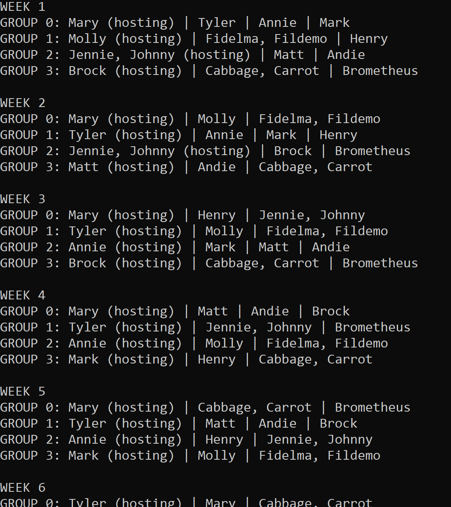
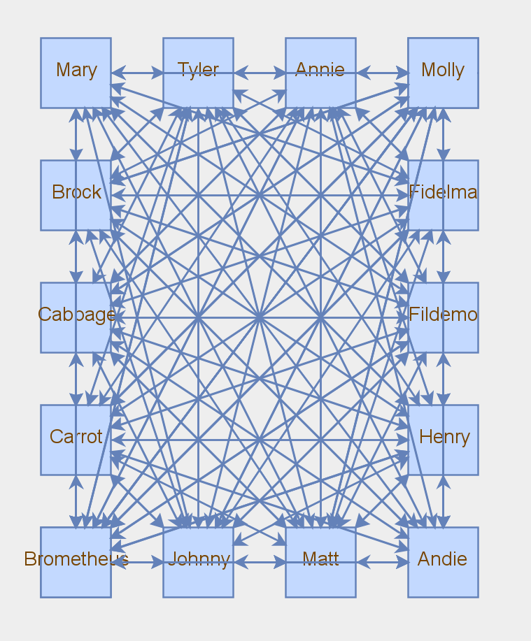
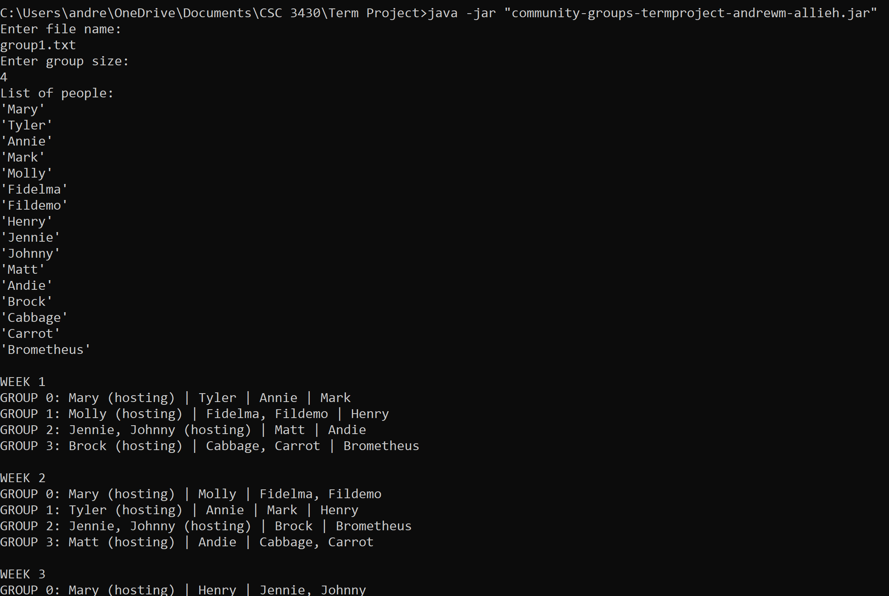
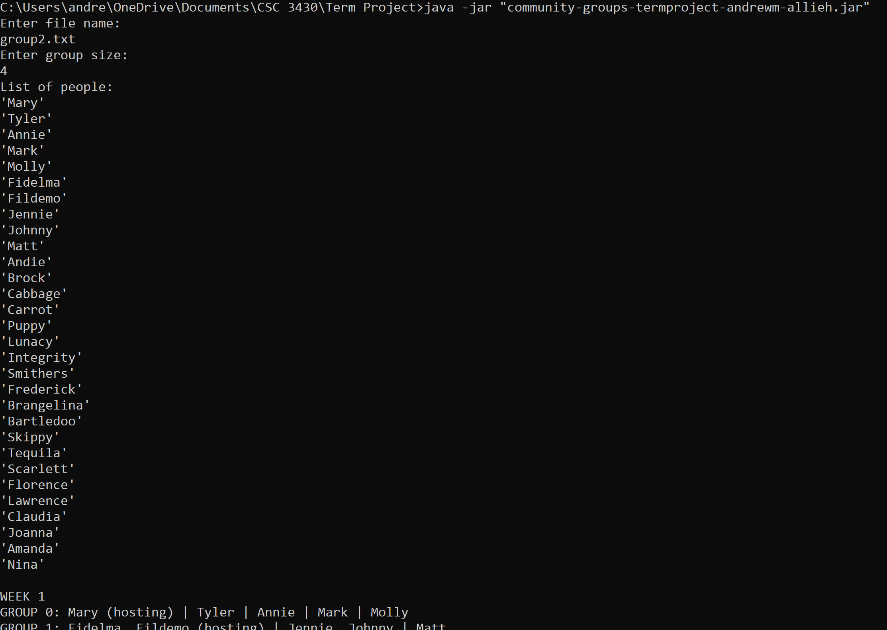
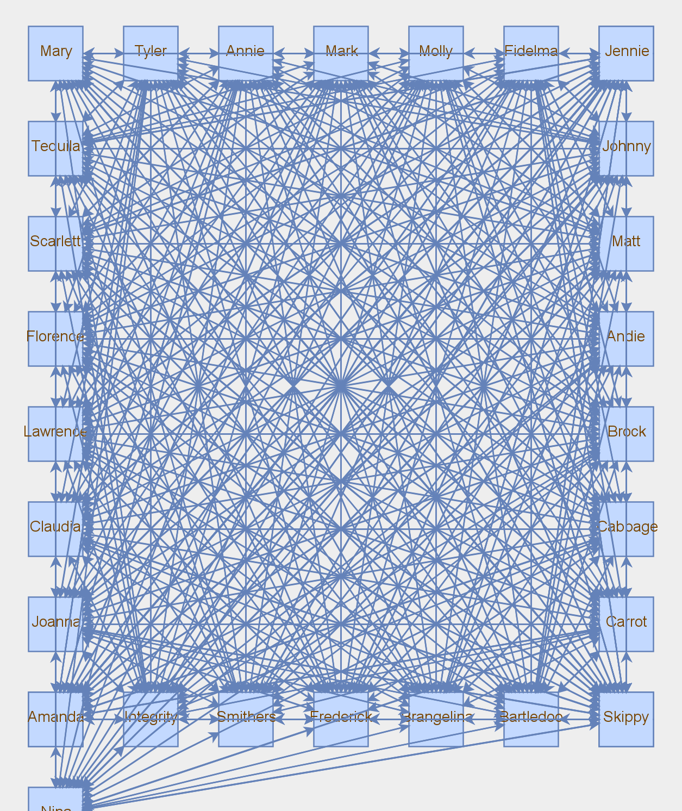
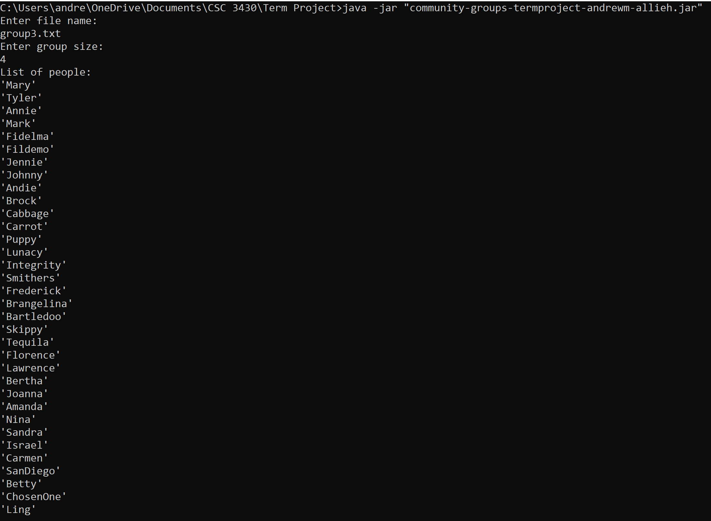
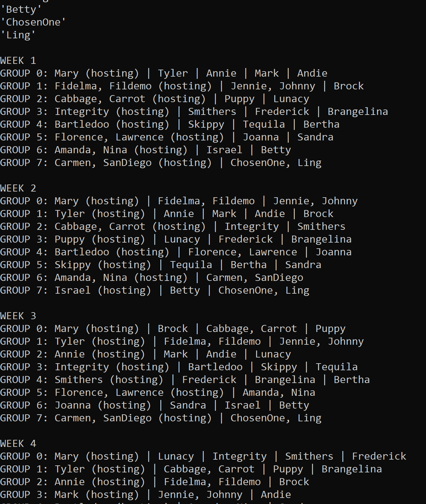
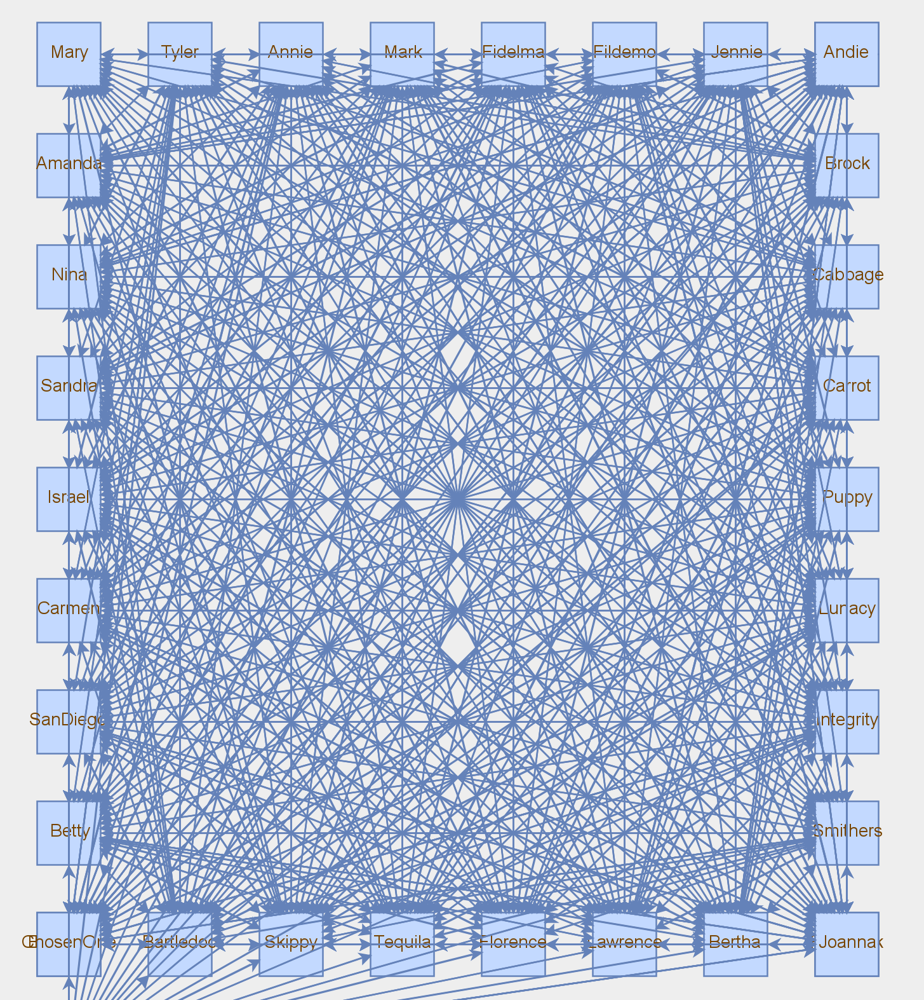
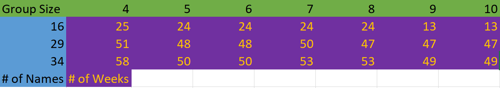

# Creating Community Small Groups
A work by: Andrew McLain and Allie Hanson

## Introduction

A church hosts weekly small group meetings so the members of the church can socialize and build relationships. There are a certain number of groups formed each week based on the chosen group size, and each group has a host. The church wants to come up with a method to minimize the number of weeks it takes for everyone to meet everyone else and make sure everyone is meeting new people as much as possible.   

## Description
This program is implemented in Java and attempts to organize groups in such a way that the number of weeks required for everyone to host everyone else is minimized. It assigns weekly small groups for church-related gatherings so that everyone eventually has the opportunity to visit everyone else's home and also host everyone else in their home. The idea is that there is a certain number of people and they need to be divided into evenly sized groups each week for gatherings. For example, if there are 16 people and the group size is 4, then there will be 4 groups of 4 people each week. Each group has a host whose home everyone in the group will go to for that week, and the goal is for everyone to eventually have the opportunity to host everyone else at their home. Married couples are always in groups together and when one partner hosts, the other one is considered a host as well. If the groups do not divide evenly, the remainder of people will be added evenly among the groups. For example, if there are 16 people and the group size is 3, there will be 4 groups of 3 and one group of 4.   

## Requirements
This program was run with the following device and software specifications:  
Intel(R) Core(TM) i5-5200U CPU @ 2.20GHz   2.19 GHz  
java version "15.0.2" 2021-01-19  
Java(TM) SE Runtime Environment (build 15.0.2+7-27)  
Java HotSpot(TM) 64-Bit Server VM (build 15.0.2+7-27, mixed mode, sharing)  
Libraries:  
JGraphT - 1.5.0  
  

## User Manual
<b> <a href="https://www.youtube.com/watch?v=irOPtOiyAAQ">Youtube Link Command Line Running</a> </b>  
<b> <a href="https://youtu.be/Lr6ZUDDwwmg">Youtube Link IntelliJ IDEA Running</a> </b>  
All one needs to run this program on their device is the jar file located in <i><b>/community-groups-termproject-andrewm-allieh/out/artifacts/community_groups_termproject_andrewm_allieh_jar</b></i> and the 3 <i>group*.txt</i> files located in the root directory for the project. I am only able to get the graphical graph to display when using the IntelliJ IDEA IDE. In this case, you must exit out of the graph window that is generated in order for the program to finish running.  

  

## Reflection
<b>Algorithm to minimize the number of iterations</b> 
The relationships between hosts and invitees is modeled as a directed graph. The algorithm works by running until a clique is formed. A clique is a graph where every node has an edge connecting it directly to every other node. We can calculate the number of edges in the clique as n*(n-1) where n is the number of nodes in the graph. The steps of the algorithm can be generally described as follows: 
  
While a clique is not formed (number of edges < n*(n-1))  
&nbsp;  Make groups for the week:  
&nbsp;&nbsp;    For each group (this process runs a number of times equal to the number of groups):  
&nbsp;&nbsp;&nbsp;      1. Find a host  
&nbsp;&nbsp;&nbsp;&nbsp;         Iterate through all the names, if a name is  
&nbsp;&nbsp;&nbsp;&nbsp;         - Not already a host for this week AND  
&nbsp;&nbsp;&nbsp;&nbsp;         - Not already an invitee for this week AND  
&nbsp;&nbsp;&nbsp;&nbsp;      - Has not already invited everyone throughout the previous weeks  
&nbsp;&nbsp;&nbsp;&nbsp;       Make that person the host of the group and continue to step 2  
&nbsp;&nbsp;&nbsp;&nbsp;         If all the names have been cycled through, iterate again except with one less condition. If a name is  
&nbsp;&nbsp;&nbsp;&nbsp;        - Not already a host for this week AND  
&nbsp;&nbsp;&nbsp;&nbsp;        - Not already an invitee for this week  
&nbsp;&nbsp;&nbsp;&nbsp;         Make that person the host of the group and continue to step 3. This deals with cases where there are no available hosts for the group   &nbsp;&nbsp;&nbsp;&nbsp;         who have not already invited everyone before  
&nbsp;&nbsp;&nbsp;      2. Find invitees, adding edges from the host nodes to invitee nodes as we do so  
&nbsp;&nbsp;&nbsp;&nbsp;        Iterate the following process a number of times equal to the group size  
&nbsp;&nbsp;&nbsp;&nbsp;          Iterate through all the names, if a name is  
&nbsp;&nbsp;&nbsp;&nbsp;          - Not already a host for this week AND  
&nbsp;&nbsp;&nbsp;&nbsp;          - Not already an invitee for this week AND  
&nbsp;&nbsp;&nbsp;&nbsp;          - Has not already been hosted by this host AND  
&nbsp;&nbsp;&nbsp;&nbsp;          - If the person is in a couple, adding two people wont exceed the group size  
&nbsp;&nbsp;&nbsp;&nbsp;           add the person to the group and increment number of edges  
&nbsp;&nbsp;&nbsp;&nbsp;         If there are still not enough members to fill the group, iterate the following process, with one less condition, a number of times equal to &nbsp;&nbsp;&nbsp;&nbsp;         the group vacancies  
&nbsp;&nbsp;&nbsp;&nbsp;          Iterate through all the names, if a name is  
&nbsp;&nbsp;&nbsp;&nbsp;           - Not already a host for this week AND  
&nbsp;&nbsp;&nbsp;&nbsp;           - Not already an invitee for this week AND  
&nbsp;&nbsp;&nbsp;&nbsp;           - If the person is in a couple, adding two people wont exceed the group size  
&nbsp;&nbsp;&nbsp;&nbsp;         add the person to the group and increment number of edges  
&nbsp;&nbsp;&nbsp;&nbsp;         If there are STILL not enough members to fill the group, iterate the following process, with another condition removed, a number of times &nbsp;&nbsp;&nbsp;&nbsp;         equal to the group vacancies  
&nbsp;&nbsp;&nbsp;&nbsp;           Iterate through all the names, if a name is  
&nbsp;&nbsp;&nbsp;&nbsp;           - Not already a host for this week AND  
&nbsp;&nbsp;&nbsp;&nbsp;          - Not already an invitee for this week  
&nbsp;&nbsp;&nbsp;&nbsp;          add the person to the group and increment number of edges    
Note: People who are in couples are always grouped together and count as two people. Additionally, whenever a person is added to the list of invitees for one half of the couple, that person is added to the list of invitees for the other half of the couple. This is done by keeping an array of "partner" values which are -1 if the person is single and an index corresponding to the nameIndex of their partner if the person is married. The adjacency list representation of relationships formed is printed to the console when the program runs. 
      
 
The logic implemented ensures that the same person cannot be in two different groups in the same week, couples are always in the same group, and a person will  only invite people they have not invited previously before re-inviting people. This avoids redundancy in invitations and minimizes the number of weeks required to form a clique.   

<b>Time complexity analysis:</b>  
The time complexity of this implementation is <b>O(n5)</b>  
The bottleneck of the program with regards to time complexity occurs in the while loop for building the clique. The outer loop for building the clique runs as many times as the number of weeks, which is linearly proportional, O(n), to the group size based on the results shown below in the Results section. Inside the outer loop, the next bottleneck are the calls to the makeGroup function. The time complexity of the makeGroup function is O(n3) (justified at the end of this section) and it is called n = (number of groups) times. Because the number of groups is a constant fraction multiple of the number of people, it is linearly proportional to the number of people and is O(n), which means the overall time complexity of the calls to makeGroup is O(n4) inside the outer loop (which is O(n)), which makes the time complexity O(n5). The justification for the time complexity of the makeGroup function being O(n3) is as follows:  
Finding a host takes up to O(n) time since it has to possibly check each person.  
&nbsp;  Once a host is found, the for-loop for adding invitees runs for the group size, which is constant.  
&nbsp;&nbsp;    Inside the for-loop, finding each invitee takes up to O(n) time since it has to possibly check each person.  
&nbsp;&nbsp;&nbsp;      Checking if each person has been invited by the host previously takes O(n) time since it has to iterate through the list of previously invited   &nbsp;&nbsp;&nbsp;      people, which is n <= number of people  
These are all of the bottlenecks in the makeGroup function, O(n) nested in O(n), nested in O(n) = O(n3) time complexity.   

<b>Difficulties</b> 
When I first tried to design the algorithm, I tried to find a way to shift and rotate rows and columns until every group was formed. This made the most sense to me visually when I first saw the problem description. However, after trying to implement it I realized there were a lot of special cases and rotations I would have to make which complicated matters and eventually reduced the problem to a greedy graphing algorithm anyway. The problem began to make more sense to me when I used a pen and paper and a simple example with 4-6 people. This is when I realized how the problem could be represented as a graph where one builds a clique. In the future I will be less hesitant to take the pen and paper approach in the initial stages of problem solving. 

## Results
Results for each list of people with group sizes of 4 below:   
group1.txt 16 NAMES, 25 WEEKS 
   
 
<a href="https://github.com/csc3430-winter2021/community-groups-termproject-andrewm-allieh/blob/master/Group1_Size4_Results.txt">Group 1 Weeks Listing File</a>  
group2.txt 29 NAMES, 51 WEEKS  
   
 
<a href="https://github.com/csc3430-winter2021/community-groups-termproject-andrewm-allieh/blob/master/Group2_Size4_Results.txt">Group 2 Weeks Listing File</a>  
group3.txt 34 NAMES, 58 WEEKS  
  
   
 
<a href="https://github.com/csc3430-winter2021/community-groups-termproject-andrewm-allieh/blob/master/Group3_Size4_Results.txt">Group 3 Weeks Listing File</a>  
<b>Results</b> 
Demonstrates O(n) relation between number of weeks and number of names  

